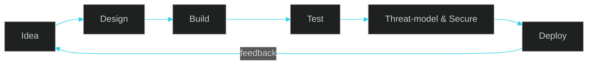

<div align="center">


<br>

<a href="https://cyberprime.netlify.app/"></a>
<a href="https://github.com/cyberprimeoffical4?tab=repositories"></a>


</div>

---

## `whoami`

```console
$ whoami
StRaNgErDrEaMeR  # developer behind CyberPrime

$ cat focus.txt
web apps · application security · linux · automation · embedded (Pico / Arduino) · AI x security
```

I build web apps and security tooling, and I tinker with hardware. I like understanding a system well enough to see where it breaks, then using that to build it better.

> [!IMPORTANT]
> All security work is done only on systems I own or have explicit permission to test.

---

## Tech stack

<div align="center">

<br>
<br>


</div>

---

## Focus areas

| Area | What I work on |
|---|---|
| 🌐 **Web** | Front-end apps, Firebase back ends, deployment on Netlify / Vercel |
| 🔐 **AppSec** | OWASP Top 10, web app testing, secure-by-default builds |
| 🐧 **Linux & Network** | Hardening, tooling, scripting, network fundamentals |
| 🤖 **Automation** | Python / Bash tooling for repetitive security and dev tasks |
| 🔌 **Hardware** | Raspberry Pi Pico and Arduino projects |
| 🧠 **AI** | Experimenting with AI applied to security workflows |

---

## Featured projects

<div align="center">

<a href="https://github.com/cyberprimeoffical4/Pico-HID">

</a>
<a href="https://github.com/cyberprimeoffical4/CyBeRpRiMe">

</a>

</div>

> Tip: add a one-line description, a screenshot, and a short "how it works" to each repo's own README. That is what makes a pinned card convincing.

---

## How I build



---

## GitHub stats

<div align="center">


</div>

---

## Roadmap

- [x] Launch the CyberPrime website
- [ ] Ship a polished, documented open-source security tool
- [ ] Publish write-ups on web vulnerabilities and lab builds
- [ ] Go deeper on Linux internals and network security
- [ ] Build an AI-assisted security automation project

---

## Connect

<div align="center">

<a href="https://cyberprime.netlify.app/"></a>
<a href="https://github.com/cyberprimeoffical4"></a>


**© CyberPrime · StRaNgErDrEaMeR**

</div>
